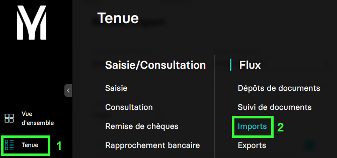
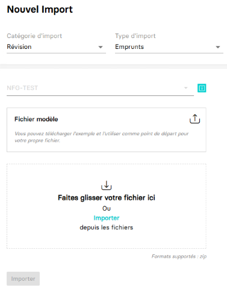

---
prev:
  text: 🐤 Introduction
  link: documentation.md
next: false
---

# Importer des emprunts

Ce guide va vous accompagner pour vous permettre d'importer des emprunts.

Dans MyUnisoft, il est possible de procéder à un import des emprunts depuis : `Tenue` > `Flux` > `Import`.



Vous obtenez la page permettant de procéder à des imports :



Une fois votre fichier sélectionné (NB: un modèle est récupérable sur cette même page ), il suffit de cliquer sur `Importer`.

## API

La route https://api.myunisoft.fr/api/v1/loans/excel permet d'effectuer la même opération depuis l'API partenaire.

```bash
curl --location --request POST 'https://api.myunisoft.fr/api/v1/loans/excel?filename=import_emprunts.zip' \
--header 'X-Third-Party-Secret: nompartenaire-L8vlKfjJ5y7zwFj2J49xo53V' \
--header 'Content-Type: application/json' \
--header 'Society-id: 1' \
--header 'Authorization: Bearer {{API_TOKEN}}' \
--data-binary '@'
```

// TODO: Vérifier si 'content-type' et 'data-binary' ok et nécessaire.

> [!IMPORTANT]
> Penser à préciser l'en-tête **society-id** si vous utilisez un 🔹 Accès cabinet.

La route attend le paramètre suivant :

| paramètre | decription |
| --- | --- |
| `filename` | Le nom du fichier (**extension incluse**) contenant les données que vous souhaitez importer |

<details class="details custom-block"><summary>Retour JSON de l'API</summary>

```json
// TODO: insérer la réponse JSON.
```

</details>

<p align="right">(<a href="#readme-top">retour en haut de page</a>)</p>
